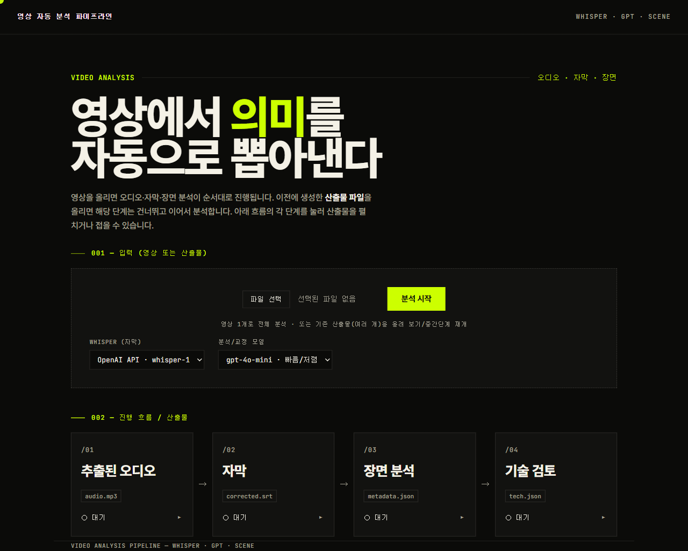
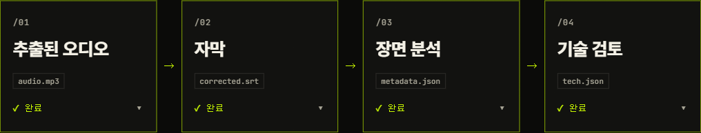
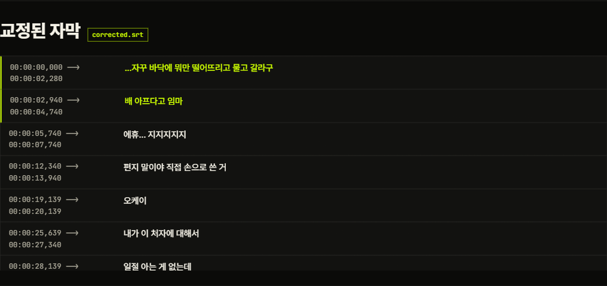
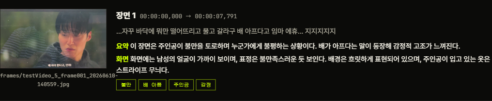
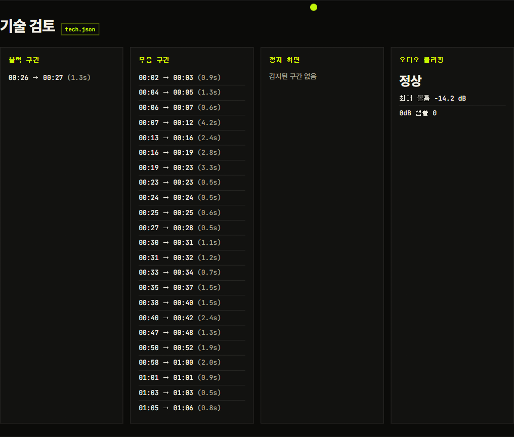

# 영상 자동 분석 파이프라인 (Video Analysis Pipeline)

영상 파일 하나를 올리면 **오디오 추출 → 자막 생성 → 자막 교정 → 장면 감지 → 장면별 분석 → 메타데이터 통합 → 기술 검토**를 자동으로 수행하고, 각 단계의 산출물을 웹 화면에서 바로 확인할 수 있는 도구입니다.

FastAPI 백엔드 + 단일 페이지(바닐라 JS) 구성으로, 로컬에서 가볍게 돌아갑니다.



---

## ✨ 주요 기능

- **7단계 파이프라인** — 업로드 한 번으로 자막·장면·기술 분석까지 자동 진행
- **Whisper 선택** — OpenAI API(`whisper-1`) 또는 **로컬 모델**(faster-whisper · base/small/medium)
- **GPT 자막 교정** — 음성 인식 오류를 교정하되 **타임코드는 절대 수정하지 않음**(텍스트만 전송 후 원본 큐에 재조립, 교정 전후 타임코드 일치 검증)
- **장면 분석** — PySceneDetect로 장면을 나누고, 장면별 대표 프레임 + 자막을 GPT 비전으로 요약/시각묘사/키워드 추출
- **기술 검토** — ffmpeg 기반 **블랙 구간 · 무음 구간 · 정지 화면 · 오디오 클리핑** 검출
- **산출물 불러오기 / 중간단계 재개** — 영상 대신 이전 산출물을 올리면 이미 끝난 단계는 건너뛰고 이어서 분석하거나, 결과만 다시 표시
- **병렬 처리 & 실시간 진행 표시** — 장면별 분석·기술 검토를 동시 실행, 플로우차트로 단계별 상태(`n/총`)를 표시
- **작업 폴더 열기** — 산출물이 저장된 폴더를 탐색기로 바로 열기

---

## 🖼️ 화면

### 진행 흐름 (플로우차트)
산출물 기준 4단계로 묶어 표시하며, 각 노드를 누르면 하단 결과 패널을 접고 펼 수 있습니다.



### 교정된 자막
교정으로 바뀐 줄은 시트론 색으로 강조됩니다. (타임코드는 원본과 동일)



### 장면별 분석
대표 프레임 + 해당 구간 자막 + GPT의 요약/화면묘사/키워드.



### 기술 검토
블랙·무음·정지·클리핑을 한눈에.



---

## 🔧 동작 방식

```
영상 ──①오디오 추출──▶ audio.mp3
         │
         └─②Whisper──▶ original.srt ─③GPT 교정──▶ corrected.srt
                                              │
영상 ──④장면 감지──▶ 장면 구간 ──⑤프레임+GPT 비전(병렬)──▶ 장면 분석
                                              │
                                       ⑥통합 ──▶ metadata.json
영상/오디오 ──⑦기술 검토(ffmpeg, 4종 병렬)──▶ tech.json
```

- **타임코드 보존**: ③ 교정 단계는 자막 텍스트만 GPT에 보내고 타임코드는 서버에 남겨두므로, 구조적으로 타임코드가 바뀔 수 없습니다.
- **25MB 대응**: OpenAI Whisper 사용 시 오디오가 25MB를 넘으면 시간 기준으로 분할 후 타임코드를 보정·병합합니다. (로컬 모델은 분할 불필요)

---

## 📦 설치

### 사전 요구사항
- **Python 3.10+**
- **ffmpeg** (PATH에 등록) — Windows: `winget install Gyan.FFmpeg`
- **OpenAI API 키** (자막 교정·장면 분석에 사용. 로컬 Whisper를 쓰더라도 교정/분석에는 필요)

### 설치
```bash
pip install -r requirements.txt
copy .env.example .env      # macOS/Linux: cp .env.example .env
# .env 파일을 열어 OPENAI_API_KEY 입력
```

`.env` (값은 본인 키로 채우세요 · 실제 키는 커밋 금지):
```
OPENAI_API_KEY=YOUR_OPENAI_API_KEY
```

---

## ▶️ 실행

```bash
uvicorn app:app --port 8000
```

브라우저에서 <http://localhost:8000> 접속 → 영상 업로드 → 분석 시작.

> 시작 시 `OPENAI_API_KEY`와 `ffmpeg`가 없으면 명확한 오류 메시지와 함께 종료됩니다.

---

## 🕹️ 사용법

1. **영상 분석**: 영상 파일을 선택하고 옵션(Whisper 백엔드/모델, 분석 모델)을 고른 뒤 **분석 시작**.
2. **결과 확인**: 진행 플로우차트가 단계별로 채워지고, 완료되면 오디오·자막·장면·기술 검토가 화면에 표시됩니다.
3. **산출물 불러오기 / 재개**: 입력에 이전 산출물(예: `*_3_corrected_*.srt`)을 올리면 해당 단계까지는 건너뛰고 이어서 분석합니다.
   - 예) `영상 + corrected.srt` → 자막 단계 건너뛰고 장면 분석부터
   - 예) `metadata.json + frames` → 처리 없이 결과만 표시
4. **작업 폴더 열기**: 결과 화면의 `📂 작업 폴더 열기`로 산출물 폴더를 탐색기에서 엽니다.

---

## 🗂️ 산출물 파일명 규칙

각 작업은 `jobs/<job_id>/` 폴더에 저장되며, 산출물은 다음 규칙을 따릅니다:

```
(파일명)_(진행단계)_(산출물명)_(시간).확장자
```

예시:
```
testVideo_1_audio_20260610-135925.mp3
testVideo_2_original_20260610-135925.srt
testVideo_3_corrected_20260610-135925.srt
testVideo_6_metadata_20260610-135925.json
testVideo_7_tech_20260610-135925.json
frames/testVideo_5_frame001_20260610-135925.jpg
```

이 규칙 덕분에 산출물을 다시 올렸을 때 역할(단계)을 자동으로 인식해 재개/표시가 가능합니다. 폴더에는 `manifest.json`이 함께 기록됩니다.

---

## 📁 프로젝트 구조

```
.
├── app.py             FastAPI: 엔드포인트, 잡 레지스트리, 업로드/결과/폴더 열기
├── pipeline.py        7단계 파이프라인 + 오케스트레이터 (오디오·자막·교정·장면·기술검토)
├── srt_utils.py       SRT 파싱/조립/시프트/병합/검증 (타임코드 안전 처리)
├── static/index.html  단일 페이지 UI (플로우차트·결과 표출, 바닐라 JS)
├── requirements.txt
├── .env.example
└── docs/              README 스크린샷
```

---

## 🧱 기술 스택

| 영역 | 사용 |
|---|---|
| 백엔드 | FastAPI · Uvicorn |
| 자막(STT) | OpenAI Whisper API · faster-whisper(로컬) |
| 교정·장면 분석 | OpenAI GPT (gpt-4o / gpt-4o-mini, 비전) |
| 장면 감지 | PySceneDetect (ContentDetector) |
| 미디어 처리 | ffmpeg / ffprobe |
| 프론트엔드 | 단일 HTML + 바닐라 JS |

---

## 🛣️ 향후 계획

- [ ] 번역/분석 시스템 프롬프트 개선
- [ ] 로컬 Whisper GPU 가속 옵션
- [ ] 분석 결과 라이브러리(목록·검색·이름변경·삭제) 영속화

---

## ⚠️ 참고

- 개인용 로컬 도구로 설계되었습니다(인증 없음, localhost 전용).
- 작업 폴더 열기 기능은 Windows(`os.startfile`) 기준입니다.
- `jobs/`, `.env`, 샘플 영상은 `.gitignore`에 포함되어 커밋되지 않습니다.
<sub>by ㅎㅅ</sub>
